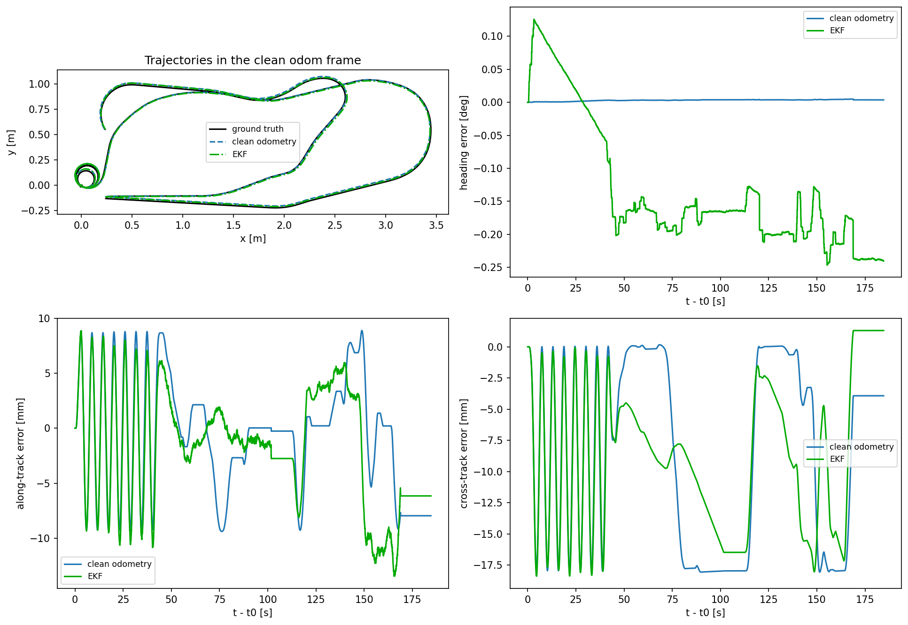
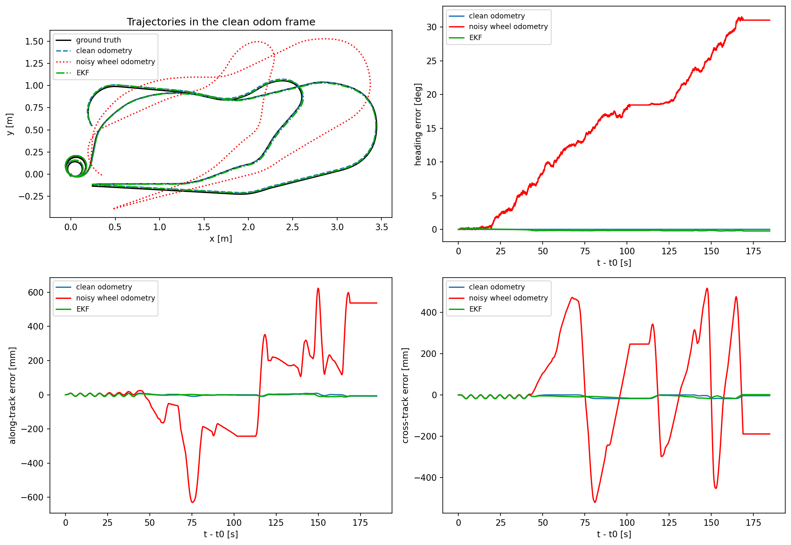
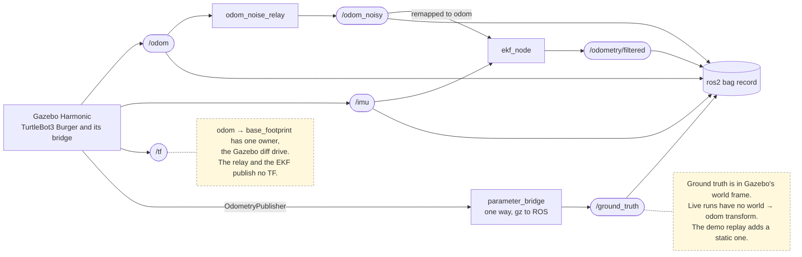
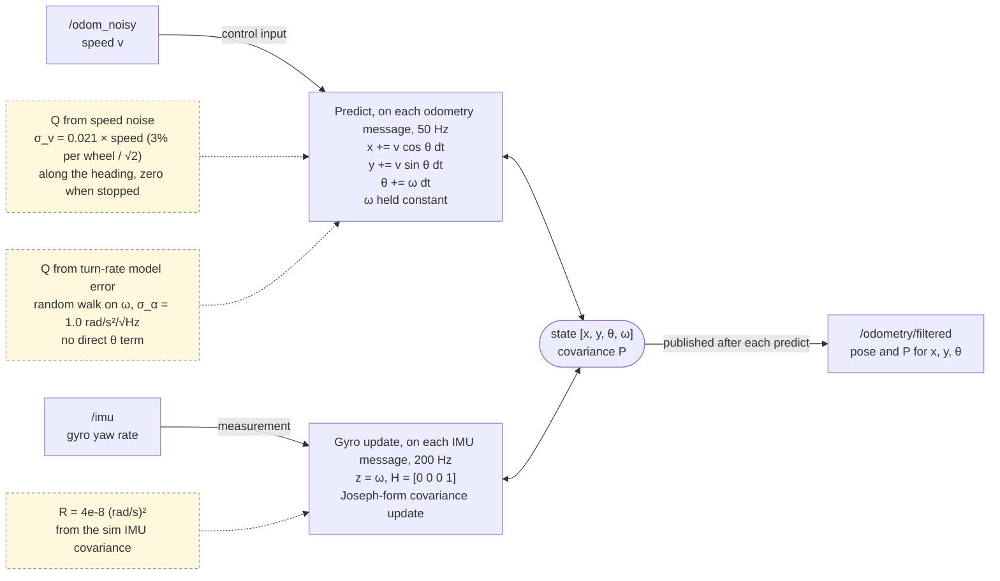

# tb3_state_estimation

This package runs an extended Kalman filter on a simulated TurtleBot3 Burger (ROS 2 Jazzy, Gazebo Harmonic) and fuses wheel odometry with the IMU gyro. In a live run with wheel slip injected into the odometry, the filter finished a 16.3 m drive 0.24 deg off Gazebo's ground-truth heading, against 31 deg for the raw wheel odometry. Position remains unobservable from wheels and a gyro, so the filter cuts position error by correcting heading, and bounding position drift needs an absolute source such as a map.

## Demo

<!-- Session 5: in GitHub's web editor, drag ekf_demo.mp4 onto this line. GitHub uploads the file and inserts a link, which the page shows as a video player. -->

Replay of the recorded run behind the results below, at 3x speed. Black is Gazebo ground truth, red is noisy wheel odometry, green is the EKF. Both estimates use the same wheel data. Raw odometry ends about 0.6 m and 31 deg off, while the EKF stays on the true path.

## Results

The live run `ekf_gt_run1` lasted 204 s of simulated time and covered 16.3 m, with 3.3 in-place turns at about 1 rad/s, loops, a U-turn and two stops. The noise relay ran at its default settings, a 0.5% wheel diameter mismatch plus 3% white noise per wheel, and the EKF node ran live on the noisy odometry and the IMU. Every track is measured against Gazebo's ground-truth pose, aligned once at the start, 0.5 s before the first motion. Clean odometry is the simulator's own wheel odometry without injected slip.

| | Clean `/odom` | Raw noisy odometry | EKF |
|---|---|---|---|
| Final heading error | 0.004 deg | 31.0 deg | 0.24 deg |
| Max heading error | 0.005 deg | 31.5 deg | 0.25 deg |
| Final position error | 8.9 mm | 570 mm | 6.3 mm |
| Max position error | 18.1 mm | 633 mm | 20.1 mm |
| RMS along / cross | 5.2 / 11.2 mm | 268 / 237 mm | 5.5 / 10.5 mm |

Raw odometry drifted 31.0 deg, against 29.2 deg expected from the noise model and inside the ±6.9 deg band of its random part. The EKF ended 0.24 deg off, and about 0.2 deg of this built up during the fast in-place turns at the start, roughly 0.06 deg per turn. In position the EKF follows clean odometry. Both show up to about 18 mm of error from how the simulated body turns, and the EKF inherits this reference error because its speed comes from the wheels.



EKF and clean wheel odometry against Gazebo ground truth on the live run. In the heading panel, the jump when the spins start and the steps at each driving turn come from a 2.5 ms gyro timing lead and do not accumulate. The slow slope during the spins is the in-place turning drift of about 0.06 deg per turn. In the position panels both tracks share the same error of up to about 18 mm, which comes from how the simulated body turns.



The same run with the noisy wheel odometry added. Raw odometry ends 31 deg and 0.57 m off. At this scale the EKF's 0.24 deg sits on the zero line.

These numbers come from one recorded run. The 20-seed offline experiment, the relay checks, the check of the live node against the offline filter and the clean-odometry study are in [docs/evaluation.md](docs/evaluation.md).

## How the estimator works

Three nodes run alongside the simulator. The relay turns clean odometry into slipping odometry, the EKF fuses the result with the gyro, and a one-way bridge exports Gazebo's true pose for evaluation.



The filter runs one predict per odometry message and one gyro update per IMU message.



### Estimator design

The filter estimates [x, y, θ, ω] for a differential-drive robot. Wheel odometry speed drives the motion model as a control input (Thrun et al., sec. 5.4). The IMU gyro corrects ω, since a gyro measures a rate and not a heading. ω is a state of its own so the rate measurement has something to observe. The covariance update uses the Joseph form, which stays symmetric and positive semi-definite under rounding (Simon, ch. 5).

Odometry pose is not fused as a measurement. In Gazebo, and on real robots, the odometry pose is the integral of the same wheel data as the odometry twist. Integrating the twist reproduces the published pose to within 1.5 mm and 0.1 deg. Fusing the pose would add no information and would make the position covariance look bounded when the real error is not. With wheels and a gyro, position is unobservable, so position uncertainty growing without bound is the correct behavior. Bounding position needs an absolute source such as scan matching against a map.

### Noise model

Process noise comes from two physical sources, and each one is zero when its cause is absent.

- Odometry speed error, mapped into the state through the Jacobian of the motion model with respect to speed. The term adds uncertainty only along the heading direction and vanishes when the robot stops. Its size, 2.1% of speed, is the 3% per-wheel noise of the injected model divided by √2.
- Turn-rate model error, as a random walk on ω. Heading gets no direct noise term because heading is the integral of ω.

The measurement noise R is the gyro variance Gazebo reports in its IMU messages, 4e-8 (rad/s)². The question behind each term is which physical effect causes the term and when the term vanishes.

### Live node design

The ROS 2 node (`ekf_node.py`) is a thin wrapper around the filter class the offline experiment uses. The node is written so the offline replay predicts the node's output.

- Initialization: the first odometry message sets the state from its own pose and turn rate, with initial covariance diag(1e-8, 1e-8, 1e-8, 1e-3). The odom frame is defined by the start pose, so position and heading are known almost exactly at the first message. IMU messages arriving before this are dropped, since there is no state to correct yet.
- Time: dt comes from each message's own `header.stamp`, converted with the same expression as the offline bag reader, so live and offline dt values are identical doubles. No `use_sim_time` is needed.
- Topics: the node subscribes to [relative names](https://docs.ros.org/en/jazzy/How-To-Guides/Node-arguments.html) (`odom`, `imu`) and publishes `odometry/filtered`. Remapping picks the input (`--ros-args -r odom:=odom_noisy`), so the node does not know whether its odometry is clean or corrupted, and the same executable takes any odometry source. The node logs the resolved topic names at startup, because a forgotten remap is otherwise invisible in the results. Heading comes from the gyro, and the speed noise moves position by only about a millimeter.
- QoS: subscriptions are [best effort](https://docs.ros.org/en/jazzy/Concepts/Intermediate/About-Quality-of-Service-Settings.html) (the ROS sensor-data profile), which connects to both reliable and best-effort publishers. The output is reliable, depth 10, for RViz and rosbag2.
- TF: the node publishes no transform. `odom -> base_footprint` keeps one owner, the simulator's odometry ([REP 105](https://www.ros.org/reps/rep-0105.html)). The EKF runs as a shadow estimator, and Nav2 and RViz still use the clean odometry transform.
- Message order: the node processes messages in arrival order, the offline replay in stamp order. Odometry and IMU share a stamp at every odometry tick, and the noisy odometry reaches the node one hop later through the relay, so the node applies the gyro sample first. The offline replay supports both orders (`run_filter(..., imu_first=True)`), and the live check confirms which one the node followed.

## Evaluation method

Gazebo's simulated odometry has no noise, so wheel slip is injected at the wheel level, a 0.5% wheel diameter mismatch (systematic, after Borenstein and Feng) plus 3% white multiplicative noise per wheel. Corrupting the wheels rather than the pose keeps the noisy odometry physically consistent, since its pose stays the integral of its own twist, as on a real robot.

The same noise model runs in two places. Offline, the model corrupts a recorded bag. Live, the model runs as a ROS 2 relay node (`odom_noise_relay`), which subscribes to clean `/odom` and republishes `/odom_noisy`. Both share one implementation, so the live system and the offline experiment use one model rather than two similar ones.

The offline stage used clean odometry as its reference and ran each configuration over 20 random seeds. Consistency was checked by how often the filter's error stays inside its own ±2 sigma band. Clean odometry was later checked against the simulator's true pose. Heading agrees to 0.001 deg, position to within 18 mm.

The live estimator is measured in three layers, each answering one question. Does the node equal the offline model on the same inputs? How does the node compare with clean odometry, the offline metric? How does the node compare with the simulator's true pose?

Each part was checked before the next part used its output. The relay was checked against its offline reference and its specification, clean odometry against ground truth, and the node against the offline filter. The checks and their numbers are in [docs/evaluation.md](docs/evaluation.md).

## Limitations

- Simulation only: all results come from Gazebo, whose simulated gyro has low noise and no bias, which favors the filter. The gyro bias sweep in [docs/evaluation.md](docs/evaluation.md) is the counterweight.
- One live run: the live numbers come from a single noise realization. The statistics come from the offline 20-seed experiment, which the live node was shown to reproduce.
- Shadow estimator: the EKF publishes `/odometry/filtered` but no TF, so Nav2 and RViz still run on the simulator's clean odometry transform.
- Reference error of clean odometry: in simulation the body turns about a point roughly 9 mm from `base_footprint`, which wheel odometry does not see. This gives up to about 18 mm of position error, which depends on turning and does not accumulate. The EKF inherits this error, and offline position figures below this level measure agreement with clean odometry, not accuracy.
- Gyro bias: the filter has no bias state, so a constant bias drifts heading with time, even while stopped, while wheel drift grows with distance. The crossover bias is wheel drift divided by duration, 0.030 deg/s for a slow run with long pauses and 0.084 deg/s for a faster continuous run, against a typical post-calibration MEMS bias of roughly 0.01 to 0.1 deg/s. Under a bias the filter is also overconfident, with its position sigma at millimeters while the error grows to decimeters.
- Common wheel scale error: the gyro does not detect a wrong wheel radius. With an accurate heading, a common scale error scales the whole trajectory about its start point, so position error equals the scale error times the displacement from start, 25.5 mm at 2.55 m with a 1% error. The filter is overconfident here too, since the error is a bias and not white noise.
- Heading drift during fast in-place turns: about 0.06 deg per full turn at 1 rad/s, always the same sign, with little added while driving at ordinary turn rates and none while stopped. Tilt of the gyro axis with the body explains about a third, and projecting the body rate into the level frame with roll and pitch from the IMU would remove the tilt part.
- Gyro timing: each 20 ms predict step uses the mean of the four latest gyro samples, centered 2.5 ms off the step's midpoint. Heading leads truth by the turn rate times 2.5 ms while turning, about 0.14 deg at 1 rad/s, and the lead disappears when the turn ends.
- Integration residual: first-order integration of the motion model against Gazebo's integrator leaves about 1 mm of error, concentrated in turns. Midpoint integration would reduce the residual, which sits two orders of magnitude below the effects measured here.

## Reproduce

Developed on Linux Mint 22.3 (Ubuntu 24.04 base) with ROS 2 Jazzy and Gazebo Harmonic (`ros-jazzy-ros-gz`).

### Build

The TurtleBot3 packages are built from source on their `jazzy` branches, as in the [TurtleBot3 e-manual](https://emanual.robotis.com/docs/en/platform/turtlebot3/simulation/). Ground truth needs one change to the burger model in `turtlebot3_simulations`, provided as a patch against `jazzy` at commit `4563301`. The patch adds Gazebo's [OdometryPublisher](https://gazebosim.org/api/sim/8/classgz_1_1sim_1_1systems_1_1OdometryPublisher.html) system to the burger's `model.sdf`, which publishes the true pose of `base_footprint` in Gazebo's world frame at 50 Hz.

```bash
cd ~/turtlebot3_ws/src
git clone https://github.com/Yigitf05/tb3_state_estimation.git
cd turtlebot3_simulations
git apply ../tb3_state_estimation/patches/ground_truth.patch
cd ~/turtlebot3_ws
rosdep install --from-paths src --ignore-src -y
colcon build --symlink-install
source install/setup.bash
export TURTLEBOT3_MODEL=burger
```

### Bags

Download the bags from the [Release page](https://github.com/Yigitf05/tb3_state_estimation/releases) and unzip them into `~/bags`.

| Bag | Content | Used for |
|---|---|---|
| `ekf_gt_run1` | live run with relay, EKF node and ground truth | results table, live figures, demo |
| `gt_run1` | clean odometry and ground truth, with the collision | clean-odometry study |
| `ekf_long_test` | 484 s of clean `/odom` and `/imu` | offline experiment, gyro bias sweep |
| `ekf_live_test` | 122 s of clean `/odom` and `/imu` | second bag in the gyro bias sweep |

Each live bag folder holds the relay's parameter file as `relay_params.yaml`. `ekf_gt_run1` also holds `ekf_commit.txt`, the commit of the node code behind the run (tag `ekf-gt-run1`).

### Record a live run

Each command runs in its own terminal, in this order. Wait 2 minutes after the simulator starts, while the robot settles on its caster.

```bash
ros2 launch turtlebot3_gazebo turtlebot3_world.launch.py
ros2 run ros_gz_bridge parameter_bridge /ground_truth@nav_msgs/msg/Odometry[gz.msgs.Odometry
ros2 run tb3_state_estimation odom_noise_relay --ros-args \
  --params-file $(ros2 pkg prefix tb3_state_estimation)/share/tb3_state_estimation/config/relay_default.yaml
ros2 run tb3_state_estimation ekf_node --ros-args -r odom:=odom_noisy
ros2 run turtlebot3_teleop teleop_keyboard
ros2 bag record -o ~/bags/my_run /odom /odom_noisy /imu /ground_truth /odometry/filtered
```

Check the EKF's startup log for the resolved input `/odom_noisy`. Stay still for 10 s at the start and the end, and keep clear of obstacles, since a bump is a real slip event. Stop the recorder first, then store the configuration with the bag:

```bash
cp $(ros2 pkg prefix tb3_state_estimation)/share/tb3_state_estimation/config/relay_default.yaml ~/bags/my_run/relay_params.yaml
git -C ~/turtlebot3_ws/src/tb3_state_estimation rev-parse --short HEAD > ~/bags/my_run/ekf_commit.txt
```

### Analyze

The scripts import each other by module name, so they run from the inner package folder, with the workspace sourced.

```bash
cd ~/turtlebot3_ws/src/tb3_state_estimation/tb3_state_estimation
python3 differential_drive_ekf.py                          # filter self-test
python3 wheel_noise.py                                     # noise model self-test
python3 compare_ground_truth.py --self-test                # alignment self-test
python3 check_wheel_noise.py ~/bags/ekf_long_test          # check A
python3 check_relay_bag.py ~/bags/ekf_gt_run1              # relay checks on a live bag
python3 check_live_ekf.py ~/bags/ekf_gt_run1               # checks E1a, E1, E2
python3 compare_ground_truth.py ~/bags/ekf_gt_run1         # check E3, results table
python3 test_noisy_odom.py ~/bags/ekf_long_test            # offline experiment, 20 seeds
python3 test_noisy_odom.py ~/bags/ekf_long_test --sweep --seeds 5   # gyro bias sweep
```

The figures in this README and in `docs/evaluation.md`:

```bash
python3 compare_ground_truth.py ~/bags/ekf_gt_run1 --noisy-topic /none --save ../docs/figures/live_ekf_vs_truth.png
python3 compare_ground_truth.py ~/bags/ekf_gt_run1 --save ../docs/figures/live_raw_vs_ekf.png
python3 compare_ground_truth.py ~/bags/gt_run1 --until 130 --noisy-topic /none --save ../docs/figures/gt_clean_odom_130s.png
python3 compare_ground_truth.py ~/bags/gt_run1 --noisy-topic /none --save ../docs/figures/gt_collision.png
python3 check_live_ekf.py ~/bags/ekf_gt_run1 --save ../docs/figures/live_node_vs_replay.png
python3 test_noisy_odom.py ~/bags/ekf_long_test --save ../docs/figures/offline_default.png
python3 test_noisy_odom.py ~/bags/ekf_long_test --gyro-bias 0.05 --save ../docs/figures/offline_gyro_bias_0p05.png
```

### Demo replay

No simulator needed. Three terminals:

```bash
ros2 run tf2_ros static_transform_publisher --x -2.0142 --y -0.5 --frame-id world --child-frame-id odom
rviz2 -d $(ros2 pkg prefix tb3_state_estimation)/share/tb3_state_estimation/rviz/ekf_replay.rviz
ros2 bag play ~/bags/ekf_gt_run1 --rate 3 --start-offset 17 --topics /ground_truth /odom_noisy /odometry/filtered
```

The static transform places the odom frame in Gazebo's world frame. The values are the anchor `compare_ground_truth.py` prints for this bag (`world <- odom`), so the picture uses the same alignment as the results table. Live runs publish no `world -> odom` transform, since AMCL's `map -> odom` would give `odom` two parents.

## Repository layout

```
tb3_state_estimation/
├── README.md
├── LICENSE                     Apache-2.0
├── package.xml, setup.py, setup.cfg, resource/, test/
├── config/                     relay parameter files (zero, mismatch only, default)
├── rviz/ekf_replay.rviz        RViz config for the demo replay
├── patches/ground_truth.patch  model.sdf change for turtlebot3_simulations (jazzy)
├── docs/
│   ├── evaluation.md           full validation write-up
│   └── figures/                all figures in this README and in evaluation.md
└── tb3_state_estimation/
    ├── differential_drive_ekf.py   filter class and self-test
    ├── wheel_noise.py              wheel-level noise model
    ├── odom_noise_relay.py         relay node, /odom in, /odom_noisy out
    ├── ekf_node.py                 EKF node, odom + imu in, odometry/filtered out
    ├── test_noisy_odom.py          offline noise-injection experiment
    ├── test_against_bag.py         offline replay of the filter on a recorded bag
    ├── check_wheel_noise.py        check A
    ├── check_relay_bag.py          checks B, C, D
    ├── check_live_ekf.py           checks E1a, E1, E2
    ├── compare_ground_truth.py     comparison against Gazebo ground truth (E3)
    └── compare_live_ekf.py         early live check on clean odometry
```

## Future work

- Gyro bias as a fifth state, estimated with zero-velocity updates while the wheels report the robot stopped.
- Tilt compensation, rotating the body angular rate into the level frame with roll and pitch, so the filter receives the true yaw rate.
- Fusing an absolute pose (AMCL) in a map-frame filter to bound position.
- Ensemble NEES consistency testing (Bar-Shalom et al.) in place of the ±2 sigma fraction.

## References

- G. Welch and G. Bishop, "An Introduction to the Kalman Filter", UNC TR 95-041.
- S. Thrun, W. Burgard and D. Fox, "Probabilistic Robotics", MIT Press, 2005, ch. 3 and 5.
- D. Simon, "Optimal State Estimation", Wiley, 2006, ch. 5.
- Y. Bar-Shalom, X. R. Li and T. Kirubarajan, "Estimation with Applications to Tracking and Navigation", Wiley, 2001, sec. 5.4.
- J. Borenstein and L. Feng, "Measurement and correction of systematic odometry errors in mobile robots", IEEE Transactions on Robotics and Automation, 12(6), 1996.
- O. J. Woodman, "An introduction to inertial navigation", University of Cambridge, UCAM-CL-TR-696, 2007.
- Z. Zhang and D. Scaramuzza, "A Tutorial on Quantitative Trajectory Evaluation for Visual(-Inertial) Odometry", IROS 2018.
- [gz-sim DiffDrive system source](https://github.com/gazebosim/gz-sim/blob/gz-sim8/src/systems/diff_drive/DiffDrive.cc)
- [gz-sim OdometryPublisher system](https://gazebosim.org/api/sim/8/classgz_1_1sim_1_1systems_1_1OdometryPublisher.html)
- [ros_gz_bridge](https://github.com/gazebosim/ros_gz/tree/jazzy/ros_gz_bridge)
- [REP 105, coordinate frames for mobile platforms](https://www.ros.org/reps/rep-0105.html)
- [ROS 2 node arguments and remapping](https://docs.ros.org/en/jazzy/How-To-Guides/Node-arguments.html), [topic names](https://design.ros2.org/articles/topic_and_service_names.html), [static remapping](https://design.ros2.org/articles/static_remapping.html)
- [ROS 2 QoS settings](https://docs.ros.org/en/jazzy/Concepts/Intermediate/About-Quality-of-Service-Settings.html)
- [ROS 2 executors](https://docs.ros.org/en/jazzy/Concepts/Intermediate/About-Executors.html)
- [ROS 2 static transforms](https://docs.ros.org/en/jazzy/Tutorials/Intermediate/Tf2/Writing-A-Tf2-Static-Broadcaster-Py.html)
- [RViz user guide](https://docs.ros.org/en/jazzy/Tutorials/Intermediate/RViz/RViz-User-Guide/RViz-User-Guide.html)
- [Recording and playing back data](https://docs.ros.org/en/jazzy/Tutorials/Beginner-CLI-Tools/Recording-And-Playing-Back-Data/Recording-And-Playing-Back-Data.html)

## License

Apache-2.0, see [LICENSE](LICENSE).
