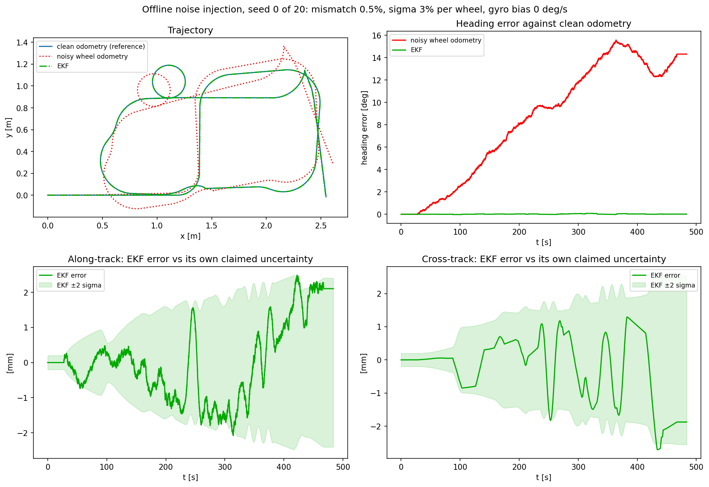
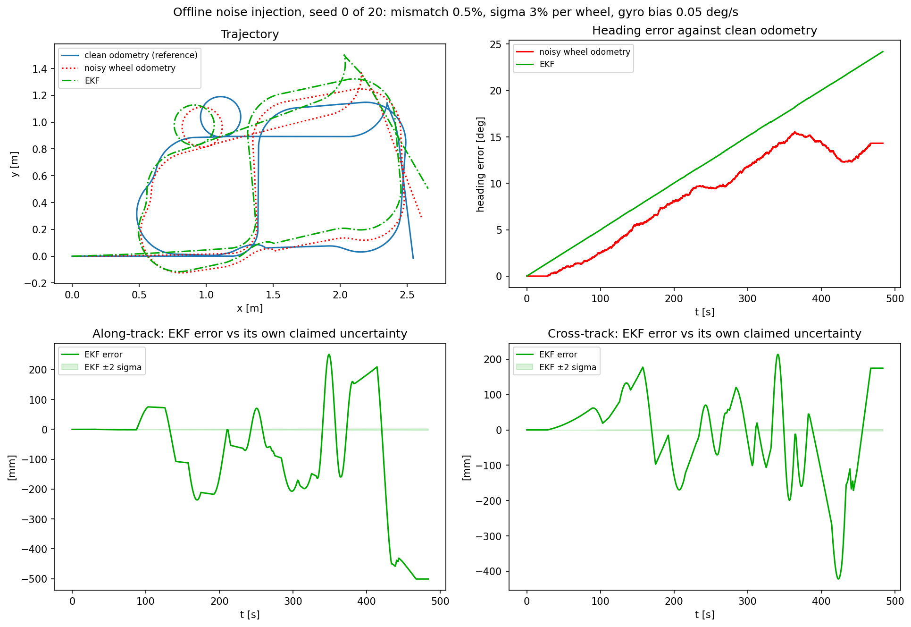
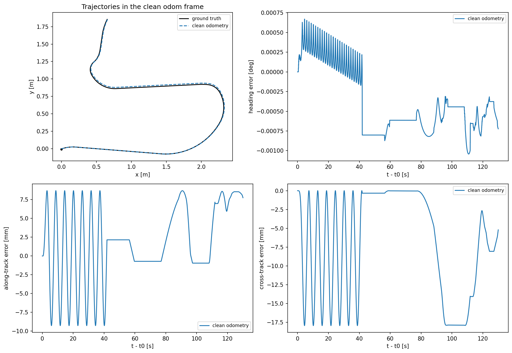
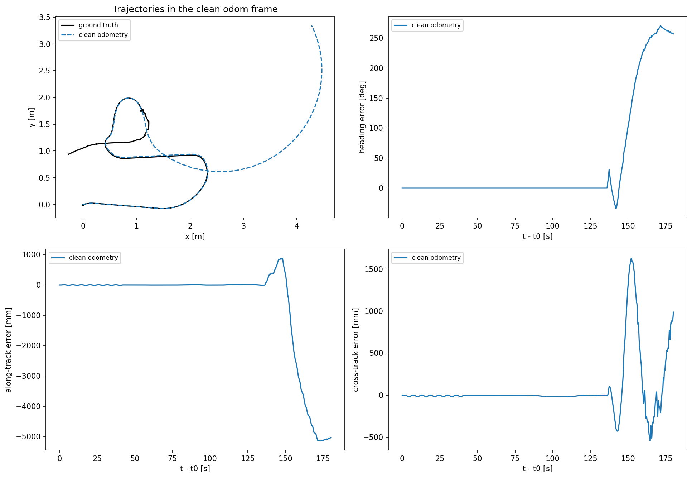
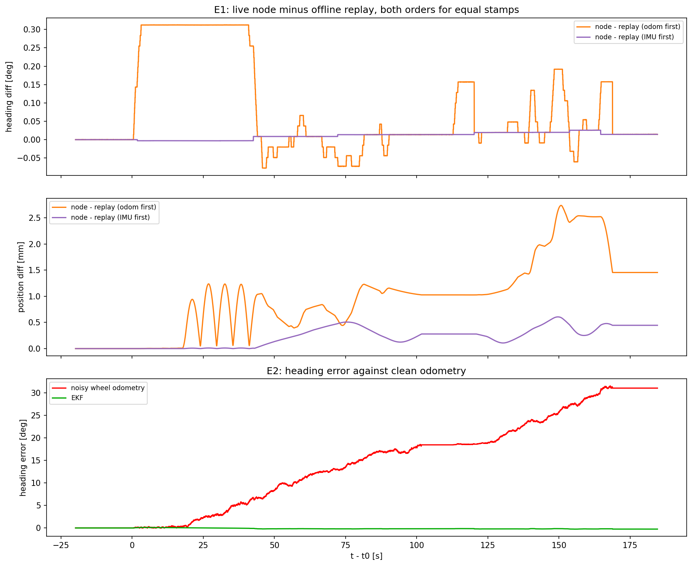

# Evaluation

This page holds the full validation behind the results in the [README](../README.md). The sections follow the order of the work. The offline experiment came first, then the relay running the same noise model live, then a check of clean odometry against Gazebo's true pose, and last the live estimator measured against the true pose.

The commands for every number and figure are under Reproduce in the README.

## 1. Offline noise injection

### Setup

The bag `ekf_long_test` holds 483.6 s and 10.87 m of clean `/odom` and `/imu`, driven slowly with several loops, pauses and one reversing segment. `test_noisy_odom.py` corrupts the wheel speeds with the default model (0.5% wheel diameter mismatch, 3% white noise per wheel), dead-reckons the raw track from the corrupted speeds, and runs the filter on the corrupted speed and the real gyro. Each configuration runs over 20 seeds. Errors are measured against clean odometry. Consistency is the fraction of moving samples where the filter's along-track and cross-track errors stay inside its own ±2 sigma band.

### Results

| | Raw noisy odometry | EKF |
|---|---|---|
| Final heading error | 14.7 deg | 0.015 deg |
| Final position error, against clean odometry | 0.31 m | 1.4 mm |
| Inside ±2 sigma (along / cross) | | 92% / 95% |

The noise model gives 14.7 deg of expected raw heading drift for this bag, and the measured drift is 14.73 deg. Drift follows signed distance, so the drift partly unwinds while reversing, which the data shows.

All errors in this table are measured against clean odometry. For heading, clean odometry equals ground truth to 0.001 deg (section 3). For position the two differ. Clean odometry sits up to 18 mm from the true pose, so the EKF's 1.4 mm is agreement with clean odometry, not accuracy against reality. The raw odometry numbers are more than ten times larger than this reference error and stand as they are.

This bag was driven slowly and contains little fast in-place turning. The live run in section 4 shows the EKF's heading error building up at about 0.06 deg per full in-place turn at 1 rad/s, so 0.015 deg is a slow-driving figure.

Offline noise injection on the 484 s bag, seed 0 of 20. Raw odometry drifts to about 14 deg of heading error and the EKF stays near zero. In the bottom panels the EKF's position error stays inside its own ±2 sigma band most of the time, 92% along-track and 95% cross-track over 20 seeds.

### Gyro bias

The simulated gyro has no bias, which favors the filter. To find where the advantage ends, `--gyro-bias` adds a constant bias to every `/imu` yaw rate before the filter sees the sample. The filter has no bias state. A bias drifts heading with elapsed time, even while the robot stands still, while wheel drift grows with distance. Setting the two equal gives the crossover bias, wheel drift divided by duration.

`ekf_long_test`, 483.6 s, 10.87 m, expected crossover 0.030 deg/s. Final errors, mean over 5 seeds. Raw odometry does not depend on the gyro bias.

| Bias [deg/s] | Raw heading [deg] | EKF heading [deg] | Raw position [m] | EKF position [m] | EKF better in |
|---|---|---|---|---|---|
| 0.000 | 14.66 | 0.01 | 0.3054 | 0.0019 | heading and position |
| 0.005 | 14.66 | 2.43 | 0.3054 | 0.0523 | heading and position |
| 0.010 | 14.66 | 4.85 | 0.3054 | 0.1049 | heading and position |
| 0.020 | 14.66 | 9.69 | 0.3054 | 0.2108 | heading and position |
| 0.050 | 14.66 | 24.20 | 0.3054 | 0.5336 | neither |
| 0.100 | 14.66 | 48.38 | 0.3054 | 1.0767 | neither |
| 0.200 | 14.66 | 96.74 | 0.3054 | 2.0920 | neither |

`ekf_live_test`, 121.8 s, 5.69 m, expected crossover 0.084 deg/s. Same columns.

| Bias [deg/s] | Raw heading [deg] | EKF heading [deg] | Raw position [m] | EKF position [m] | EKF better in |
|---|---|---|---|---|---|
| 0.000 | 10.40 | 0.02 | 0.2683 | 0.0028 | heading and position |
| 0.005 | 10.40 | 0.58 | 0.2683 | 0.0104 | heading and position |
| 0.010 | 10.40 | 1.19 | 0.2683 | 0.0230 | heading and position |
| 0.020 | 10.40 | 2.41 | 0.2683 | 0.0481 | heading and position |
| 0.050 | 10.40 | 6.07 | 0.2683 | 0.1224 | heading and position |
| 0.100 | 10.40 | 12.16 | 0.2683 | 0.2427 | position only |
| 0.200 | 10.40 | 24.34 | 0.2683 | 0.4688 | neither |

Interpolating the EKF heading column gives crossovers within about 3% of the expected values. The slow bag with long pauses tolerates about a third of the bias the faster bag tolerates, because the gyro keeps drifting through every pause while the wheels do not. On the faster bag, position crosses over at a higher bias than heading, since a heading error turns into position error only while the robot moves. Typical post-calibration MEMS gyro bias is roughly 0.01 to 0.1 deg/s (Woodman, 2007), so the advantage depends on the hardware and on how the robot is driven.

The long bag with a constant gyro bias of 0.05 deg/s, above its crossover. The filter has no bias state, so its heading drifts with time, already while parked at the start, and ends near 24 deg against raw odometry's 14.7 deg. The ±2 sigma band in the bottom panels is the flat line at zero. The filter reports about 2 mm of uncertainty while the error reaches 0.5 m, and over 20 seeds the error stays inside the band for 12.4% of moving samples along-track and 0.7% cross-track.

## 2. Live noise relay

The relay (`odom_noise_relay`) publishes `/odom_noisy` with pose and twist kept consistent. The relay splits the clean twist into wheel speeds, corrupts each wheel, recombines them, and integrates its own pose with the same Euler step, the same `header.stamp` time source and the same dt guards as the filter. The noise logic lives in `WheelOdomCorruptor` (`wheel_noise.py`), a class without ROS code, and the node handles parameters, the random generator, and the subscription and publisher. The relay publishes no TF, since `odom -> base_footprint` already has one owner.

Four checks ran before the relay was trusted. Each tests a single property, so a failure points at one place. Checks B and C used a zero-noise run (`relay_zero`), D1 a mismatch-only run (`relay_mismatch`), and D2 a run with default noise (`relay_default`).

| Check | Question | Result |
|---|---|---|
| A, offline | Does the live implementation match the offline reference? | Differences exactly 0.0 on both bags, deterministic and noise paths |
| B1, live | Does the relay equal its specification, Euler integration of the clean twist? | Twist and pose identical, to 1e-15 and 0.0 |
| C, live | Is the `/odom_noisy` pose the integral of its own twist? | Agrees to 1e-15 m on every run |
| D1, live | Is the systematic drift the right size? | 9.584 deg measured against 9.637 deg expected over 5.383 m |
| D2, live | Is the random noise the right size? | Normalized twist noise std 0.987, expected 1.000 ± 0.022 |

Two supporting measurements:

- Integration residual: with noise off, the relay's pose differs from Gazebo's own pose by 1.42 mm and 0.146 deg over a 3 minute run. This measures Gazebo's integrator against the first-order Euler step the filter uses, not the relay. The offline experiment gave 1.5 mm from an independent measurement.
- Systematic drift: a 0.5% wheel diameter mismatch over a wheel separation of 0.16 m gives 1.79 deg of heading drift per meter of signed distance (Borenstein and Feng, 1996). Measured drift matched this to within 0.6%.

The checks were themselves tested. Swapping the order of the Euler update makes check A fail at 6 mm, so a passing result means something. A negative test on D2 is also worth noting. With the injected noise secretly doubled, the heading check still passed, because a single run's heading band is wide compared to the effect. Only the normalized twist test caught the change, at std 1.98. Heading error alone is too blunt to validate a noise model from one run.

## 3. Clean odometry against Gazebo ground truth

The offline experiment used clean `/odom` as its truth reference. Gazebo's wheels slip against the ground while its odometry still reports perfect motion, so this assumption was tested against the simulator's actual pose.

### Setup

- Source: Gazebo's [OdometryPublisher](https://gazebosim.org/api/sim/8/classgz_1_1sim_1_1systems_1_1OdometryPublisher.html) system, added to the burger's `model.sdf`, publishes the pose of `base_footprint` in the world frame as `/ground_truth` at 50 Hz. A one-way `ros_gz_bridge` converts the topic to `nav_msgs/Odometry`, the same type as `/odom`, so the existing bag tools read the topic unchanged. The system's TF output goes to an unbridged topic, so `odom -> base_footprint` keeps its single owner.
- Frames: odometry lives in its own `odom` frame, whose origin is the spawn pose. Ground truth lives in Gazebo's world frame. The two are related by one fixed SE(2) transform, found at a stationary anchor instant t0 as T_WO = G(t0) ∘ O(t0)⁻¹ and applied as G_O(t) = T_WO⁻¹ ∘ G(t). The anchor sits 0.5 s before the first motion. A least-squares fit over the whole path was rejected on purpose, since its rotation would absorb the heading drift being measured (Zhang and Scaramuzza, 2018). Each track is anchored separately.
- Time: both streams are matched on `header.stamp`, which Gazebo fills with sim time. No node needs `use_sim_time`. All 8031 stamps in the analyzed window matched exactly.
- Checks on the script: before use, a synthetic self-test recovers a known answer in cases including a 30 deg rotated spawn (error 5e-14 m, where plain position subtraction would be off by 1.3 m), a 0.3% scale error, a 0.1% rotation scale error, and ground truth sampled half a period out of step. The self-test also caught a design flaw. Anchoring on the last stationary sample left a permanent 1 mm offset, which is why the anchor sits 0.5 s inside the stationary stretch.

### Protocol

The simulator settled for 2 minutes before recording. Run `gt_run1` lasted 211 s in total, with 7 in-place spins at 1 rad/s, then driving with loops, a U-turn and a 13 s stop. At about 137 s after t0 the robot hit an obstacle, so the verdict uses the 130 s before the collision. The collision is reported separately below.

### Results

Clean `/odom` against ground truth, three analysis windows, all measured from t0:

| Window | Content | Max heading error | Max position error | Final position error |
|---|---|---|---|---|
| 0 to 45 s | Spins only, path 0.00 m | 0.0008 deg | 17.96 mm | 2.17 mm |
| 0 to 130 s | Spins and normal driving, 5.70 m | 0.0010 deg | 17.96 mm | 9.34 mm |
| Full run, 180 s | Includes the collision | 179.9 deg | 5148 mm | 5130 mm |

Other outputs from the 130 s window:

- Spin ratio: odometry 2531.0 deg against truth 2531.0 deg over 7 turns, ratio 1.00000. Rotation is exact.
- Stationary drift: 0.000 mm of true motion in both stationary stretches after settling. Before the settle period, the robot crept 14 mm while coming to rest on its caster.
- Scale fit: fitting the position error as a constant times the displacement from start leaves a residual as large as the error itself. There is no measurable wheel scale error.
- Error timing: position error first exceeds 5 mm 2.0 s after t0, during the spins, and never exceeds 20 mm before the collision.

The later run `ekf_gt_run1` reproduced this on a path three times longer (16.30 m), with max heading error 0.005 deg, max position error 18.07 mm and spin ratio 1.00000. The position bound did not grow with distance.

Clean wheel odometry against Gazebo ground truth, first 130 s of `gt_run1`. Heading agrees to 0.001 deg. The position error shows one sine wave per in-place spin and stays under 18 mm. The error follows how much the robot has turned, not how far the robot has driven.

### Interpretation

Heading from clean odometry equals true heading to 0.001 deg. The EKF's heading results and raw odometry's heading drift therefore hold against the real pose.

Position differs by up to 18 mm, and the error has a clear signature. The error depends on how much the robot has turned, not on how far the robot has driven. During the spins, `base_footprint` traces a circle of about 9 mm radius while odometry, which only integrates wheel speed, reports the robot standing still (a scale fit of the spin window gives exactly minus 100%, residual 0.03 mm). One sine wave per turn is visible in the along-track and cross-track error plots. In simulation the body turns about a point roughly 9 mm from `base_footprint`, while wheel odometry assumes the body turns about `base_footprint` itself. A body turning about a point offset by d moves the tracked point by at most 2d, about 18 mm, reached at a half turn. The same number appears as the peak cross-track error at the U-turn and as the maximum in both windows. The error is bounded and does not grow with distance. The physical cause inside the simulator (caster drag, wheel scrub, contact model) was not isolated.

A decision rule was fixed before the run. At most 5 mm and 0.05 deg would mean the offline results stand unchanged. At most 50 mm and 0.1 deg would mean the raw headline numbers stand, but millimeter-level EKF position numbers must be labeled as measured against clean odometry. The result, 18 mm and 0.001 deg, falls in the second band. The offline experiment was not rerun, and every live estimator run from here on records `/ground_truth` in the same bag and is measured against the true pose directly.

### The collision

About 137 s after t0 the robot drove into an obstacle and the wheels kept turning. Odometry reported a smooth arc several meters long while the body barely moved. Position error reached 5.1 m and heading error 180 deg within seconds, and nothing in the odometry stream signaled a problem. After the robot stopped, the body still moved 3.3 mm and rotated 13.5 deg while wedged against the obstacle, with odometry reporting zero motion. This is wheel slip in its plainest form, and the reason a real robot needs an absolute position source such as scan matching against a map. The gyro would have caught the heading part. Nothing on board catches the position part.

The full `gt_run1`, including the collision about 137 s after the start. The wheels kept turning against the obstacle, odometry reported several meters of motion, and the error reached 5.1 m and 180 deg. Nothing in the odometry stream showed a problem.

## 4. Live estimator against Gazebo ground truth

### Setup

- Chain: Gazebo publishes clean `/odom`, the relay publishes `/odom_noisy` (default noise, 0.5% mismatch, 3% per wheel, seed 0), and the EKF node runs on `/odom_noisy` and `/imu`. The ground-truth bridge runs alongside. Nothing new broadcasts TF.
- Run `ekf_gt_run1`: fresh bring-up, 2 minute settle, then bridge, relay, EKF node and recorder, in this order. Recorded `/odom /odom_noisy /imu /ground_truth /odometry/filtered`. 204 s of odometry (sim time ran at about 0.93 of real time), 16.30 m of path with no reversing, 1195 deg (3.3 turns) of in-place spins at about 1 rad/s, loops, a U-turn, and stops of 11 s and 16 s. No contact with obstacles.
- Provenance: the relay's parameter file and the node's git commit hash are stored in the bag folder, so the bag names the exact configuration behind the run. The node code is also tagged `ekf-gt-run1` in the repository.
- Before recording: the startup log showed the resolved input `/odom_noisy` and an initial pose at the odom origin. `ros2 node info` listed only `/odom_noisy` and `/imu` as subscriptions. While stationary, the published heading variance grew from 1e-8 to 5.8e-8 rad² in about 4 minutes, and the actual stationary heading drift was about 1 sigma of this.

### Checks

Each check tests one property, in order, so a failure points at one place.

| Check | Question | Result |
|---|---|---|
| Relay C, D2 | Did the relay behave in this run? | Pose is the integral of twist to 3e-15 m, twist noise std 1.017 (expected 1 ± 0.024), all 10223 messages matched |
| E1a | Does the node run in the noisy odometry's frame? | First recorded pose equals `/odom_noisy` to 3e-23 m, heading differs by 0.003 deg of stationary gyro drift |
| E1 | Does the live node equal the offline model on the same inputs? | Matches the IMU-first replay to 0.026 deg and 0.6 mm, the odom-first replay differs by 0.31 deg. No messages missed |
| E2 | How does the node compare with clean odometry, the offline metric? | 0.25 deg and 5.6 mm final |
| E3 | How does the node compare with the true pose? | See the results below |

E1a has a limit worth stating. The robot spawns at the odom origin, so initializing from the first message and initializing from zeros look the same on this run. The startup log is the direct evidence the node initialized from the message.

E1 replays the bag's own `/odom_noisy` and `/imu` through the offline filter, starting from the node's first recorded state, in both possible orders for messages sharing a stamp. Odometry and IMU share a stamp at every odometry tick, and the noisy odometry reaches the node one hop later through the relay, so the node should see the gyro sample first. The node matched the gyro-first order. The size of the gap to the other order, about the turn rate times 5 ms, is itself the evidence of which order the node saw.

Check E1. The live node against the offline filter replayed on the same recorded inputs, in both orders for messages with equal stamps. The node matches the IMU-first replay to 0.026 deg and 0.6 mm. The odom-first replay differs by up to 0.31 deg during turns, which shows the order the node saw. Bottom panel: heading error against clean odometry.

### Results against ground truth

All tracks anchored at t0, 0.5 s before the first motion.

| | Clean `/odom` | Raw noisy odometry | EKF |
|---|---|---|---|
| Final heading error | 0.004 deg | 31.0 deg | 0.24 deg |
| Max heading error | 0.005 deg | 31.5 deg | 0.25 deg |
| Final position error | 8.9 mm | 570 mm | 6.3 mm |
| Max position error | 18.1 mm | 633 mm | 20.1 mm |
| RMS along / cross | 5.2 / 11.2 mm | 268 / 237 mm | 5.5 / 10.5 mm |

The raw drift matches the noise model, 29.2 deg expected from 16.30 m of signed distance and 31.0 deg measured, inside the ±6.9 deg band set by the random-walk part. Against clean odometry (E2) the EKF ended at 0.25 deg and 5.6 mm, the same picture. The figures for this run are in the README.

### Where the EKF's heading error comes from

Read from the heading-error time series:

- While stopped: flat. No gyro bias, consistent with the stationary check before recording.
- While driving: the error steps up and back at each turn, with a net change of only about 0.04 deg over all the driving. The steps are a timing offset, not drift. For each 20 ms step the filter uses the mean of the four latest gyro samples, which is centered 2.5 ms after the step's midpoint. While turning, heading therefore leads truth by the turn rate times 2.5 ms (about 0.14 deg at 1 rad/s), and the lead vanishes when the turn ends.
- During in-place spins: about 0.2 deg of the final 0.24 deg, accumulated steadily at the same sign, roughly 0.06 deg per full turn at 1 rad/s.

The robot rests pitched about 0.64 deg on its caster, so the gyro's axis is tilted and the gyro reads the yaw rate times cos(0.64°). The tilt accounts for 0.022 deg per turn with the right sign, about a third of the measured drift. The rest is not isolated.

The tilt explanation implies a spin ratio of 0.99994. The measured ratio was 1.00001, which looked like a rejection, but the time series showed the drift happening during the spins after all. The spin ratio counts only samples turning faster than 0.2 rad/s, so the timing lead, which appears at spin-up and vanishes at spin-down, only partly cancels inside the metric and masked the drift. A summary number reflects only the samples inside its window, and the time series settled the question.

### What this means for the headline numbers

- Heading: the EKF's advantage holds against the true pose, 0.24 deg against 31 deg for raw odometry after 16 m. Its size depends on how much fast in-place turning a run contains.
- Position: the live EKF inherits clean odometry's turn-driven reference error of up to about 18 mm. The filter takes speed from the wheels, and a gyro measures rotation, not sideways motion. The offline 1.4 mm figure is agreement with clean odometry, as labeled in section 1.
